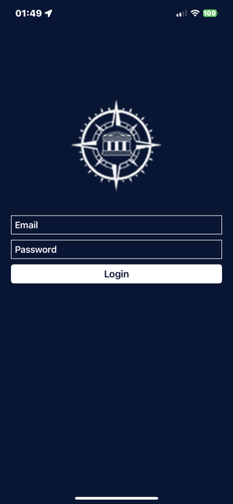
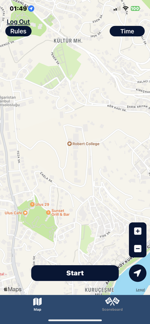
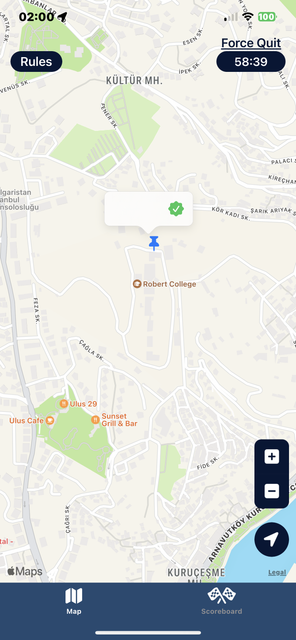
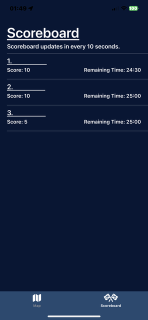
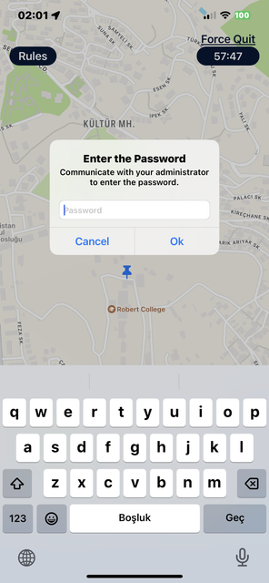
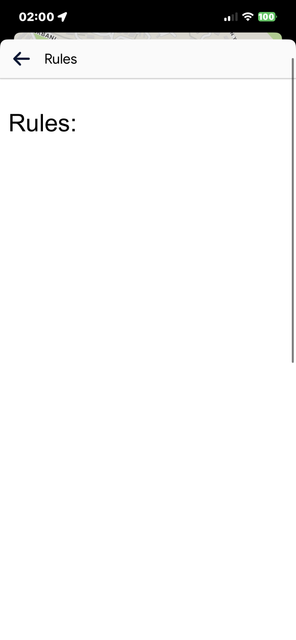

[![Swift Version][swift-image]][swift-url]
[![Platform][platform-image]][platform-url]
[![License][license-image]][license-url]

# Radventure

<br />
<p align="center">
  <a href="https://canduru.net">
    
  </a>
  <p align="center">
    This app created with Swift to iOS platform using Firebase. User can start orienteering activity, answer questions, and see live scoreboard.
  </p>
</p>

Radventure (shipped as **Robert Compass**) is a UIKit iOS app that turns a school campus into an
orienteering course. A team signs in with its Robert College Microsoft account, starts a timed
game, walks to each checkpoint on the map, and is scored only when the device's GPS position
matches the checkpoint *and* the team answers the question attached to it. Scores and remaining
time stream back into Firebase so every team sees the same live scoreboard. It is built for the
school staff running freshman orientation activities and for the students taking part.

## Status

This application is currently in the development stage.

## Features

- [x] Start Activity
- [x] GPS + Question Control for Location
- [x] Force quit with administrator key
- [x] Features of rules page, timer, zoom in and out, and etc.
- [x] Live Scoreboard (updated every 10 seconds)
- [x] Team Synchronization
- [x] Microsoft (Entra ID) sign-in through Firebase Auth, restricted to one tenant
- [x] Standard and satellite map modes, on-screen compass, single-device session guard
- [x] Profile page with the team's last games and an admin-gated score reset

## Tech Stack

| Layer | What is used |
| --- | --- |
| Language / UI | Swift 5.0, UIKit (programmatic views), MapKit, CoreLocation |
| Auth | Firebase Auth with a Microsoft `OAuthProvider` |
| Data | Cloud Firestore (`users`) and Realtime Database (`games`, `scores`) |
| Ops | Firebase Analytics, Crashlytics, Performance, Messaging, In-App Messaging, App Check (App Attest) |
| Dependencies | CocoaPods |

## Requirements

- iOS 14.0+ (app target deployment target; the project was built with Xcode 14.3.1)
- Xcode 14.3.1 or newer
- CocoaPods
- A Firebase project with Auth, Firestore, and Realtime Database enabled
- A Microsoft Entra ID (Azure AD) tenant registered as a Firebase Auth provider

## Getting Started

### 1. Install dependencies

The project uses [CocoaPods](http://cocoapods.org/) for `Firebase, Analytics, Messaging, Crashlytics, Performance, App Check, In-app Messaging`.
The `Podfile` is already in the repository, so a clone only needs:

```bash
pod install
```

For reference, the pods declared in the `Podfile` are:

```ruby
  use_frameworks!

  pod 'FirebaseAnalytics'
  pod 'FirebaseAuth'
  pod 'FirebaseFirestore'
  pod 'FirebaseDatabase'
  pod 'FirebaseMessaging'
  pod 'FirebaseCrashlytics'
  pod 'FirebasePerformance'
  pod 'FirebaseAppCheck'
  pod 'FirebaseInAppMessaging', "> 10.7-beta"
```

### 2. Add the configuration files

Two files are required at build time and are **deliberately not committed** — they are listed in
`.gitignore` because they carry project-specific configuration. Create them locally and add them
to the `Radventure` target:

| File | Contents (names only) | Where it comes from |
| --- | --- | --- |
| `Radventure/GoogleService-Info.plist` | standard Firebase iOS config keys | Firebase console → Project settings → iOS app |
| `Radventure/Keys.plist` | a single `tenantID` string key | the Microsoft Entra ID tenant ID used for sign-in |

`Keys.plist` is read at login time in `LogInViewController.logIn()` and passed to the Firebase
Microsoft provider as the `tenant` custom parameter.

### 3. Run

```bash
open Radventure.xcworkspace
```

Open the **workspace** (not the `.xcodeproj`), select the `Radventure` scheme and a device or
simulator, then run. App Check uses App Attest, so a physical device is needed for a realistic
sign-in run.

### Tests

```bash
xcodebuild test -workspace Radventure.xcworkspace -scheme Radventure -destination 'platform=iOS Simulator,name=iPhone 15'
```

`RadventureTests` and `RadventureUITests` are the default Xcode templates and contain no
project-specific assertions yet.

## Project Structure

```
Radventure/
├── AppDelegate.swift          Firebase + App Check bootstrap
├── SceneDelegate.swift
├── TabBarViewController.swift Map / Scoreboard tabs
├── Login/
│   └── LogInViewController.swift    Microsoft sign-in, single-device session guard
├── Home/
│   ├── HomeMapViewController.swift  map, timer, checkpoints, questions, scoring
│   └── CustomAnnotation.swift
├── Score Board/
│   ├── ScoreboardViewController.swift   live scoreboard (10 s refresh)
│   └── ScoreboardTableViewCell.swift
├── Profile/
│   ├── ProfileViewController.swift  past games, admin score reset
│   └── TableViewCell.swift
├── Helper/
│   ├── AppCheck.swift          App Attest provider factory
│   ├── CompassCanvas.swift     compass needle drawing
│   ├── LocationManager.swift   CoreLocation wrapper
│   ├── LoadingViewController.swift
│   └── RulesViewController.swift
└── Assets.xcassets, Info.plist, Radventure.entitlements
```

## Continuous Integration

None. There are no GitHub Actions workflows in this repository; builds and releases are done
locally from Xcode.

## Photos from Application

<p align="center">


</p>

<p align="center">


</p>

<p align="center">


</p>

## Changelog

See [CHANGELOG.md](CHANGELOG.md).

## License

Distributed under the MIT License. See [LICENSE](LICENSE) for details.

## Meta

Can Duru — [https://canduru.net](https://canduru.net) — canduru2004@gmail.com, support@canduru.net

[https://github.com/CanDuru4](https://github.com/CanDuru4)

[swift-image]: https://img.shields.io/badge/swift-5.0-orange.svg
[swift-url]: https://swift.org/
[platform-image]: https://img.shields.io/badge/platform-iOS%2014.0%2B-lightgrey.svg
[platform-url]: https://developer.apple.com/ios/
[license-image]: https://img.shields.io/badge/license-MIT-blue.svg
[license-url]: LICENSE
